<p align="center">
  
</p>

<h1 align="center">🎪 WONDERLAND</h1>

<p align="center">
  <strong>Premium Full-Stack Travel Marketplace & Lodging Platform</strong>
</p>

<p align="center">
Discover unique stays • Explore destinations • Host unforgettable experiences
</p>

<p align="center">

<a href="https://wonderland-8sm7.onrender.com">

</a>

&nbsp;

<a href="https://github.com/mihirgupta665/Wonderland-Project">

</a>

&nbsp;

<a href="https://github.com/mihirgupta665/Wonderland-Project/releases/download/v1.0.0/Wonderland_Demo.mp4">

</a>

</p>

<p align="center">


</p>

---

# 🌍 Live Demo

Experience the complete Wonderland platform, including secure authentication, property management, interactive maps, image uploads, reviews, favorites, and responsive design.

### 🚀 Live Application

<p align="center">
  <a href="https://wonderland-8sm7.onrender.com">
    
  </a>
</p>

<p align="center">
  <strong>
    <a href="https://wonderland-8sm7.onrender.com">
      https://wonderland-8sm7.onrender.com
    </a>
  </strong>
</p>

### 🔑 Demo Account

| Username | Password |
|:---------:|:--------:|
| **admin** | **admin123** |

> **Note:** Use this account to explore landlord features such as creating, editing, and deleting property listings.

---

# 📖 About Wonderland

Wonderland is a production-inspired full-stack travel marketplace that allows users to discover unique accommodations, create and manage listings, upload property images, explore locations using interactive maps, save favorite destinations, and share reviews through an elegant and responsive interface.

Built using the **MVC architecture**, the application integrates **MongoDB Atlas**, **Cloudinary**, and **Mapbox** to simulate the workflow of a modern property marketplace while emphasizing clean code organization, secure authentication, RESTful design, and production-ready deployment practices.

---

# ⭐ Project Highlights

- 🔐 Secure authentication using Passport.js
- 👤 Role-Based Authorization (RBAC)
- 🏠 Complete CRUD operations for property listings
- 🗺️ Interactive Mapbox maps with location markers
- ☁️ Cloudinary image upload and management
- ❤️ AJAX-powered favorites system
- ⭐ Reviews and rating functionality
- 🔍 Dynamic property search
- 📱 Fully responsive Bootstrap interface
- 🗄️ MongoDB Atlas cloud database
- 🚀 Deployed on Render
- 🛡️ Secure environment variable management

---

# 📑 Table of Contents

- 📖 About
- ⭐ Project Highlights
- 📸 Project Showcase
- 🎥 Demo GIF
- 🎬 Demo Video
- ✨ Features
- 🛠️ Technology Stack
- 🏗️ Architecture
- 📁 Project Structure
- ⚙️ Installation
- 🔐 Environment Variables
- 🚀 Deployment
- 🔮 Future Improvements
- 👨‍💻 Author

---

# 📸 Project Showcase

> A glimpse of the key workflows and user experience offered by Wonderland.

---

# 🏠 Core Experience

## Home Page

<p align="center">
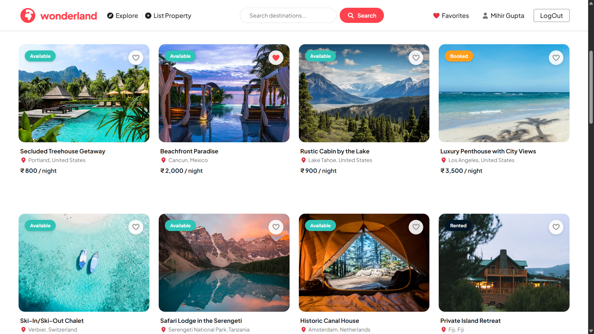
</p>

---

## Explore Listings

<p align="center">
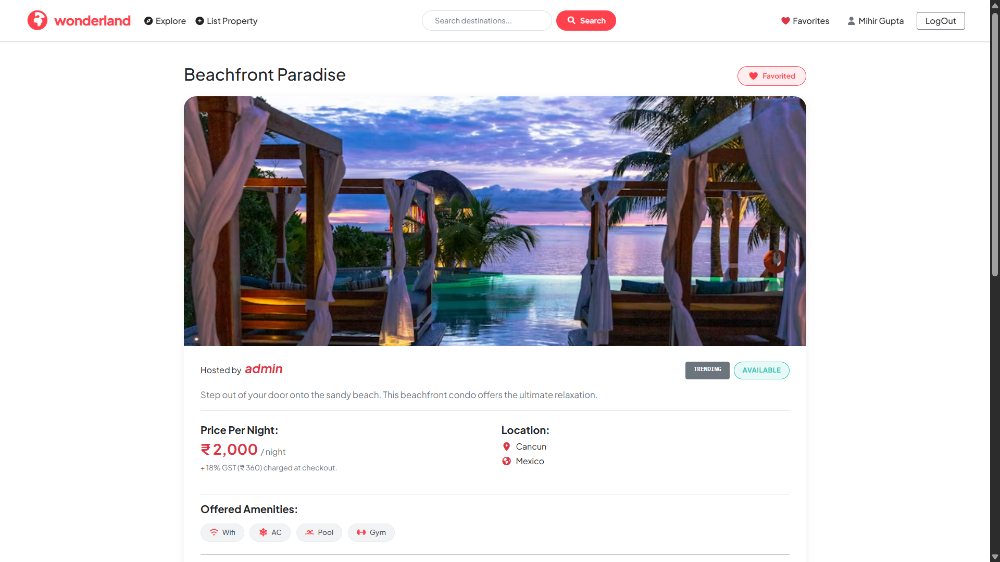
</p>

---

## Reviews & Comments

<p align="center">
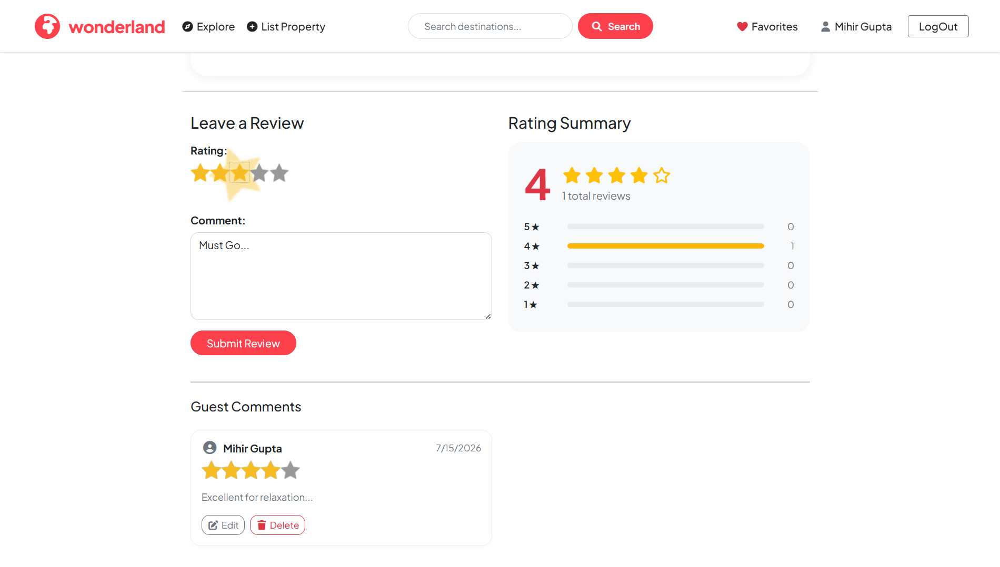
</p>

---

## Interactive Map

<p align="center">
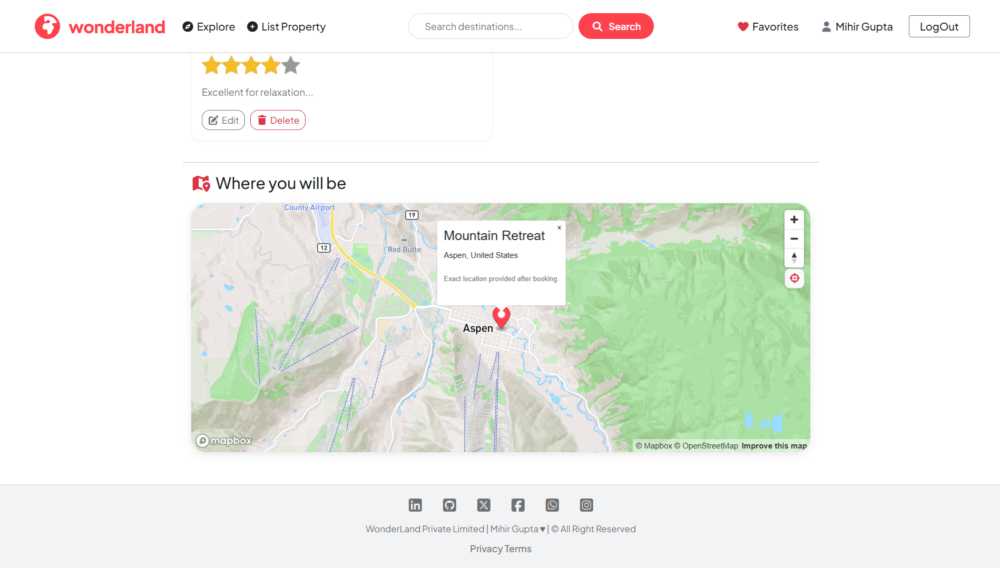
</p>

---

# ❤️ User Experience

## Smart Search

<p align="center">
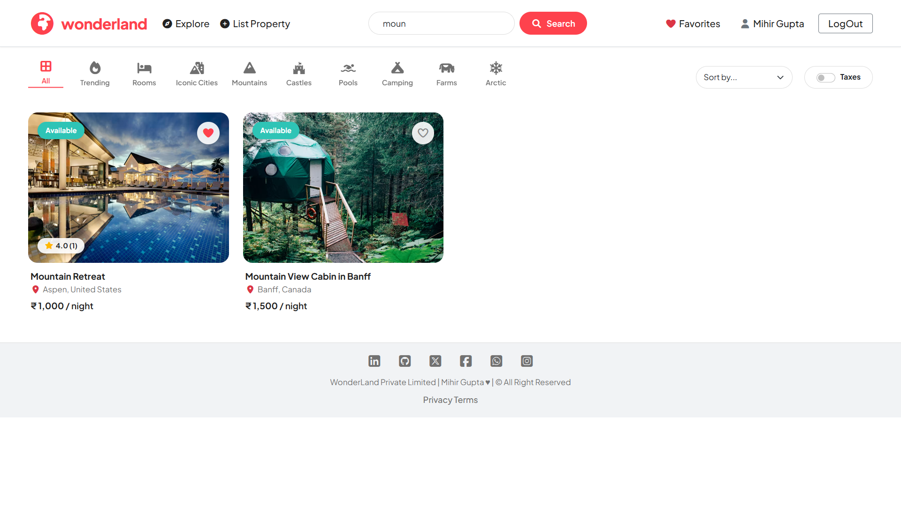
</p>

---

## Favorites

<p align="center">
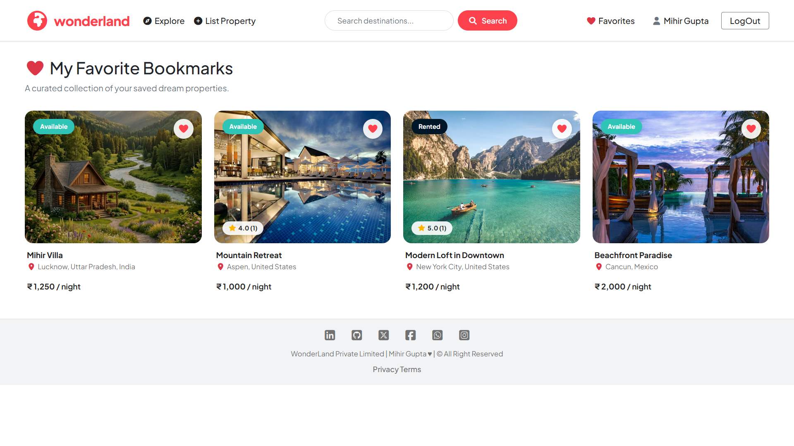
</p>

---

# 🏡 Host Experience

## Create Listing

<p align="center">
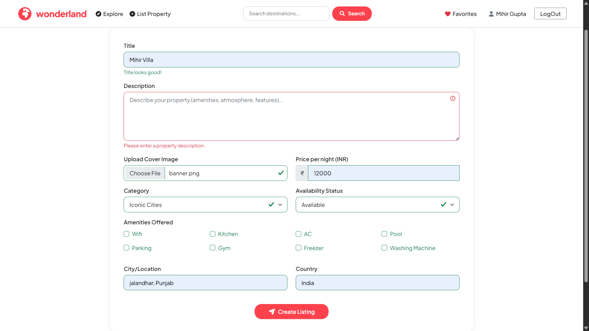
</p>

---

## Edit Listing

<p align="center">
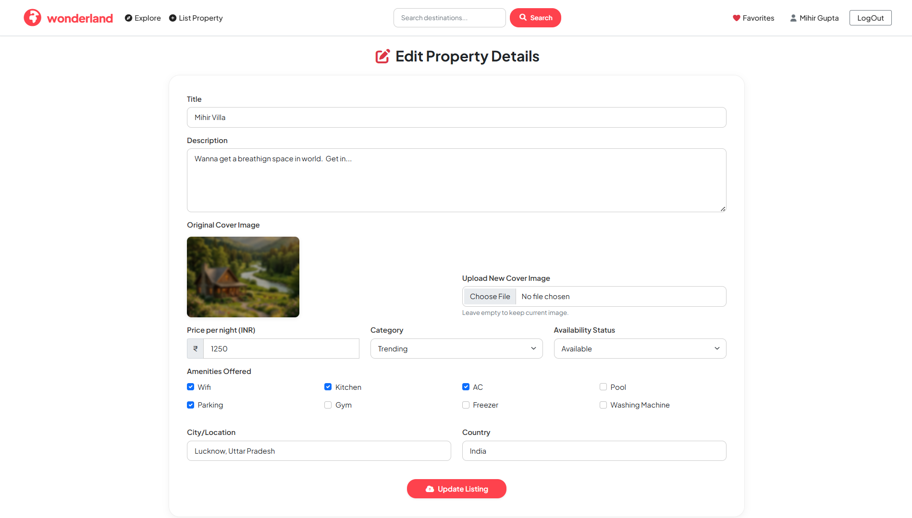
</p>

---

## User Registration

<p align="center">
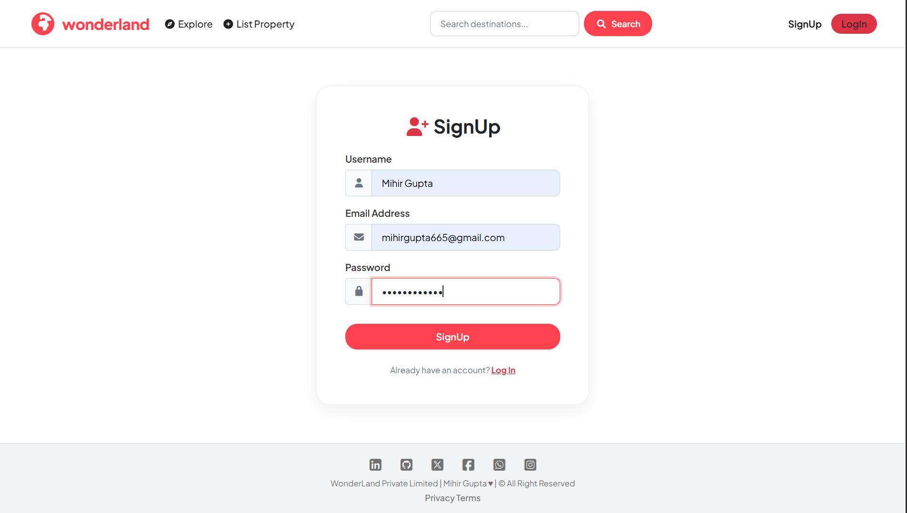
</p>

---

# 📱 Responsive Design

## Mobile Home

<p align="center">
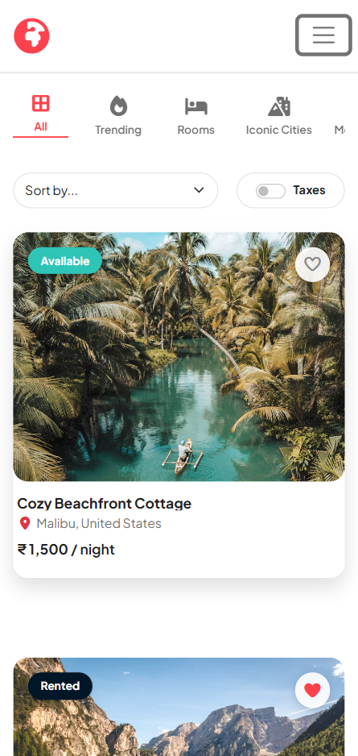
</p>

---

## Mobile Property Details

<p align="center">
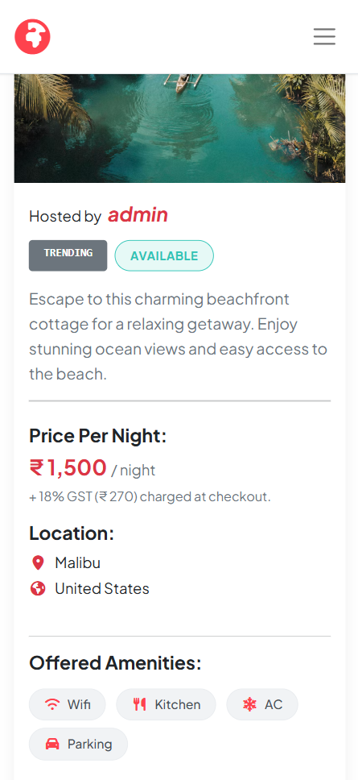
</p>

---

# 🎥 Project Demonstration

A quick walkthrough of **Wonderland**, showcasing the complete user journey—from exploring properties to managing listings and interacting with key platform features.

<p align="center">
  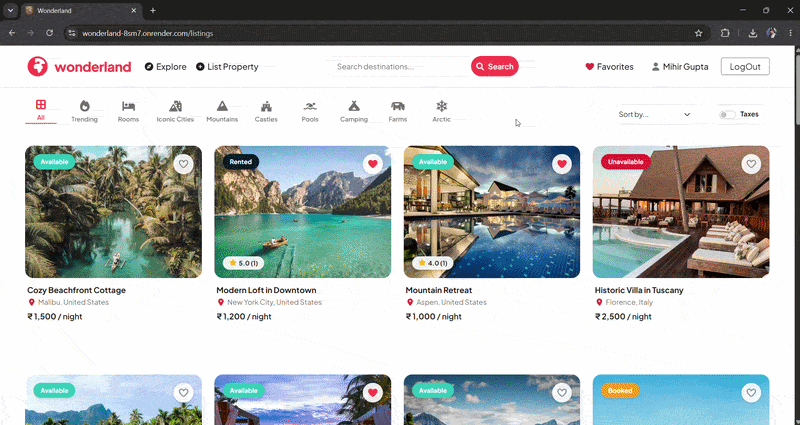
</p>

---

# 🎬 Project Walkthrough

Watch the complete walkthrough of **Wonderland**, covering the application's architecture, user workflow, authentication, listing management, favorites, reviews, interactive maps, and responsive design.

<p align="center">

<a href="https://github.com/mihirgupta665/Wonderland-Project/releases/download/v1.0.0/Wonderland_Demo.mp4">
  
</a>

</p>

---

# ✨ Features

## 👤 User Features

- Browse premium travel accommodations across multiple categories.
- Search properties by title or location.
- View detailed property pages with amenities and pricing.
- Explore destinations through interactive Mapbox maps.
- Bookmark favorite listings with an AJAX-powered favorites system.
- Leave ratings and reviews for listed properties.
- Enjoy a responsive experience across desktop and mobile devices.

---

## 🏠 Landlord Features

- Create new property listings.
- Upload listing images directly to Cloudinary.
- Edit property details, pricing, and categories.
- Delete listings with automatic media cleanup.
- Automatic location geocoding using Mapbox.

---

## 🔐 Security Features

- Passport.js authentication.
- Role-Based Authorization (RBAC).
- Session management.
- Protected routes.
- Secure environment variables.
- Input validation and centralized error handling.

---

# 🛠️ Technology Stack

| Category | Technologies |
|----------|--------------|
| **Frontend** | EJS, HTML5, CSS3, Bootstrap 5, JavaScript (ES6) |
| **Backend** | Node.js, Express.js |
| **Database** | MongoDB Atlas, Mongoose |
| **Authentication** | Passport.js, Express Session |
| **Cloud Storage** | Cloudinary |
| **Maps & Geocoding** | Mapbox GL JS |
| **Deployment** | Render |

---

# 🏗️ System Architecture

Wonderland follows the **MVC (Model-View-Controller)** architecture to maintain a clean and modular codebase.

```text
                  Client Browser
                         │
                 Express.js Server
        ┌────────────┼────────────┐
        │            │            │
 MongoDB Atlas   Cloudinary   Mapbox API
```

### Architecture Highlights

- MVC Project Structure
- RESTful Routing
- Modular Controllers
- Secure Authentication
- Cloud Image Storage
- Interactive Maps

---

# 📁 Project Structure

```text
Wonderland/
│
├── controllers/
│   ├── listings.js
│   ├── reviews.js
│   └── users.js
│
├── init/
│
├── models/
│
├── public/
│   ├── css/
│   ├── js/
│   └── images/
│
├── routes/
│
├── utility/
│
├── views/
│   ├── includes/
│   ├── layouts/
│   ├── listings/
│   ├── reviews/
│   └── users/
│
├── app.js
├── middleware.js
├── cloudConfig.js
├── schema.js
├── package.json
└── README.md
```

---

# 🔌 REST API Overview

### Listings

| Method | Endpoint | Description |
|---------|----------|-------------|
| GET | `/listings` | Fetch all listings |
| GET | `/listings/new` | New listing page |
| POST | `/listings` | Create listing |
| GET | `/listings/:id` | View listing |
| GET | `/listings/:id/edit` | Edit listing page |
| PUT | `/listings/:id` | Update listing |
| DELETE | `/listings/:id` | Delete listing |

---

### Reviews

| Method | Endpoint | Description |
|---------|----------|-------------|
| POST | `/listings/:id/reviews` | Add review |
| GET | `/reviews/:id/edit` | Edit review page |
| PUT | `/reviews/:id` | Update review |
| DELETE | `/reviews/:id` | Delete review |

---

### Authentication

| Method | Endpoint | Description |
|---------|----------|-------------|
| GET | `/signup` | Registration page |
| POST | `/signup` | Register user |
| GET | `/login` | Login page |
| POST | `/login` | Authenticate user |
| GET | `/logout` | Logout user |

---

### Favorites

| Method | Endpoint | Description |
|---------|----------|-------------|
| GET | `/favorites` | View favorites |
| POST | `/favorites/:id` | Add favorite |
| DELETE | `/favorites/:id` | Remove favorite |

---

# ⚙️ Installation

Clone the repository

```bash
git clone https://github.com/mihirgupta665/Wonderland-Project.git
```

Navigate into the project

```bash
cd Wonderland-Project
```

Install dependencies

```bash
npm install
```

Seed the database

```bash
node init/index.js
```

Start the development server

```bash
npm start
```

Open

```text
http://localhost:8080
```

---

# 🔐 Environment Variables

Create a `.env` file in the project root.

```env
ATLAS_DBURL=your_mongodb_connection_string

SECRET=your_session_secret

MAP_TOKEN=your_mapbox_public_token

CLOUD_NAME=your_cloudinary_cloud_name

CLOUD_API_KEY=your_cloudinary_api_key

CLOUD_API_SECRET=your_cloudinary_api_secret

NODE_ENV=development
```

---

# 🚀 Deployment

| Service | Purpose |
|---------|---------|
| **Render** | Web Application Hosting |
| **MongoDB Atlas** | Cloud Database |
| **Cloudinary** | Media Storage |
| **Mapbox** | Maps & Geocoding |

---

# 📈 Engineering Highlights

- MVC Architecture
- RESTful API Design
- Passport.js Authentication
- Role-Based Authorization (RBAC)
- MongoDB Atlas Integration
- Cloudinary Media Management
- Mapbox Location Services
- AJAX Favorites
- Responsive Bootstrap UI
- Environment-based Configuration
- Production Deployment

---

# 🔮 Future Improvements

The following enhancements are planned for future releases:

- 📅 Property booking and reservation system
- 💳 Secure online payments
- 🔔 Email and in-app notifications
- 🔐 Google OAuth authentication
- ❤️ Wishlist synchronization across devices
- 📆 Availability calendar for hosts
- 🤖 AI-powered property recommendations
- 🌍 Multi-language support

---

# 🤝 Contributing

Contributions are welcome!

If you'd like to improve Wonderland:

1. Fork the repository
2. Create a new feature branch
3. Commit your changes
4. Push to your branch
5. Open a Pull Request

Please ensure your code follows the existing project structure and coding style.

---

# 📄 License

This project is licensed under the **MIT License**.

You are free to use, modify, and distribute this project for educational and personal purposes.

---

# 👨‍💻 Author

## Mihir Gupta

B.Tech Computer Science Engineering (AI & ML)

Passionate Full-Stack & AI Developer focused on building scalable, user-centric web applications.

### Connect With Me

- 🌐 **GitHub:** https://github.com/mihirgupta665
- 💼 **LinkedIn:** https://www.linkedin.com/in/YOUR-LINKEDIN
- 🌍 **Portfolio:** https://YOUR-PORTFOLIO-LINK

---

# 🙏 Acknowledgements

Special thanks to the open-source technologies that made this project possible.

- Node.js
- Express.js
- MongoDB Atlas
- Bootstrap
- Passport.js
- Cloudinary
- Mapbox
- Render

---

# ⭐ Support

If you found this project helpful, consider giving it a ⭐ on GitHub.

Your support motivates me to continue building high-quality open-source projects and sharing them with the developer community.

---

<p align="center">

### 🎪 Thank you for visiting Wonderland!

**Happy Exploring • Happy Coding ❤️**

</p>